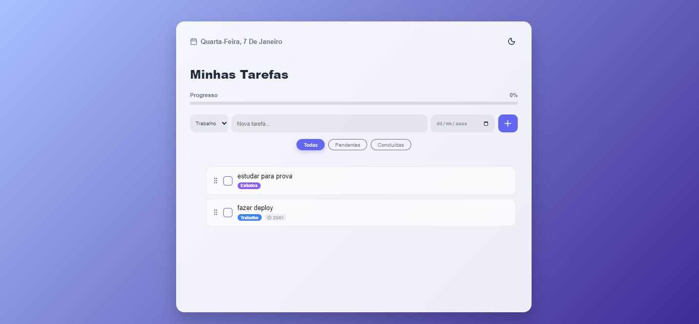

# ✨ To-Do List Full Stack

Uma aplicação moderna de gerenciamento de tarefas (To-Do List) desenvolvida com **ReactJS** e **Django**. O projeto foca em uma experiência de usuário fluida (UX), design sofisticado e arquitetura robusta.

<div align="center">
  
</div>

<br>

## 📸 Funcionalidades

- **Frontend Moderno:** Interface com efeito **Glassmorphism** (vidro fosco), totalmente responsiva e estilizada.
- **Backend Robusto:** API RESTful construída com **Django REST Framework** e **Python**.
- **Interatividade:**
  - **Drag & Drop:** Reordene suas tarefas arrastando (powered by `@dnd-kit`).
  - **Confetti:** Animação de celebração ao completar todas as tarefas.
  - **Edição:** Edite textos e status em tempo real.
- **Organização:**
  - Categorias (Pessoal, Trabalho, Estudos) com etiquetas coloridas.
  - Definição de prazos com alerta visual de atraso.
  - Filtros (Todas, Pendentes, Concluídas).

## 🛠️ Tecnologias Utilizadas

### Frontend
- **ReactJS** + Vite
- **Lucide React** (Ícones)
- **React Confetti**
- **Dnd-kit** (Drag and Drop)
- **CSS3** (Variáveis, Flexbox, Glassmorphism)

### Backend
- **Python 3**
- **Django** & **Django REST Framework**
- **SQLite** (Banco de dados)
- **Django CORS Headers**

---

## 🚀 Como rodar o projeto

Siga os passos abaixo para rodar a aplicação no seu computador:

### 1. Clone o repositório
```bash
git clone [https://github.com/SEU_USUARIO/todo-list-fullstack.git](https://github.com/SEU_USUARIO/todo-list-fullstack.git)
cd todo-list-fullstack

```

### 2. Configurando o Backend (Django)

Abra um terminal, entre na pasta do backend e instale as dependências:

```bash
cd backend_todo

# Cria o ambiente virtual
python -m venv venv

# Ativa o ambiente
# No Windows:
.\venv\Scripts\Activate
# No Linux/Mac: source venv/bin/activate

# Instala as dependências necessárias
pip install django djangorestframework django-cors-headers

# Prepara o banco de dados
python manage.py makemigrations
python manage.py migrate

# Roda o servidor
python manage.py runserver

```

*O backend estará rodando em: `http://127.0.0.1:8000/*`

### 3. Configurando o Frontend (React)

Abra um **novo terminal**, entre na pasta do frontend e inicie a interface:

```bash
cd to-do-list

# Instala os pacotes do Node
npm install

# Roda o projeto
npm run dev

```

*O frontend estará rodando em: `http://localhost:5173/*`

---

### 📝 Status do Projeto

* [x] Integração Front/Back
* [x] Persistência de Dados (SQLite)
* [x] Funcionalidades de UX (Drag & Drop, Confetti)
* [ ] Deploy na Nuvem

---

Desenvolvido com 💜 por **Jhennifer**